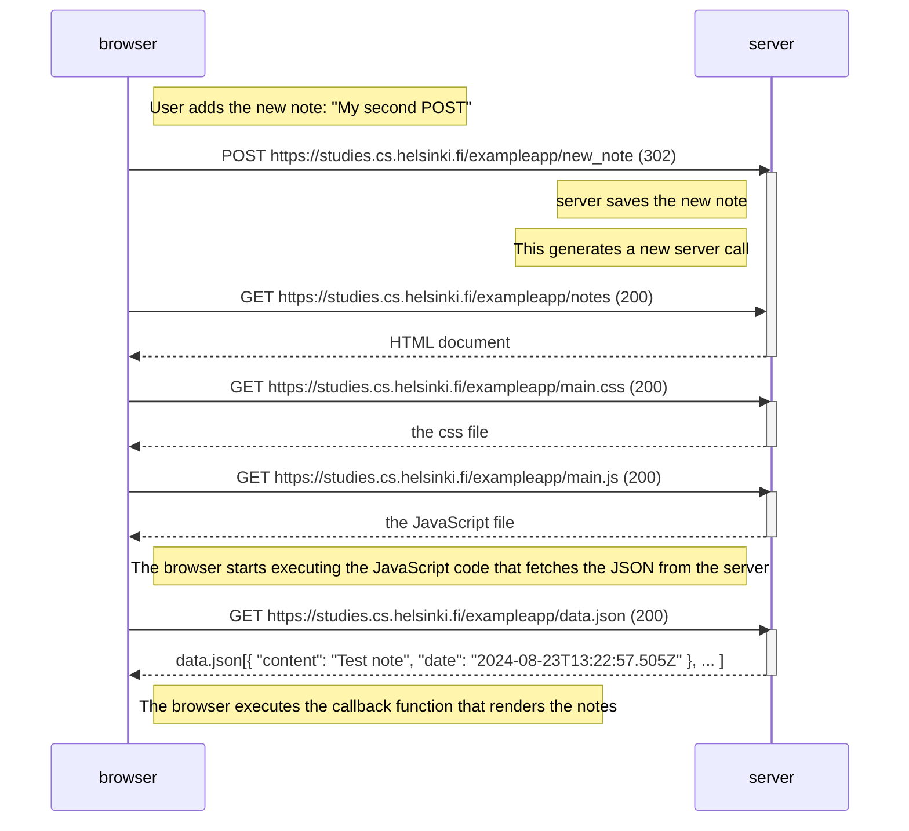

```mermaid

sequenceDiagram
    participant browser
    participant server

    Note right of browser: User adds the new note: "My second POST"

    browser->>server: POST https://studies.cs.helsinki.fi/exampleapp/new_note (302)
    activate server
    Note left of server: server saves the new note
    Note left of server: This generates a new server call
    browser->>server: GET https://studies.cs.helsinki.fi/exampleapp/notes (200)
    server-->>browser: HTML document
    deactivate server

    browser->>server: GET https://studies.cs.helsinki.fi/exampleapp/main.css (200)
    activate server
    server-->>browser: the css file
    deactivate server

    browser->>server: GET https://studies.cs.helsinki.fi/exampleapp/main.js (200)
    activate server
    server-->>browser: the JavaScript file
    deactivate server

    Note right of browser: The browser starts executing the JavaScript code that fetches the JSON from the server

    browser->>server: GET https://studies.cs.helsinki.fi/exampleapp/data.json (200)
    activate server
    server-->>browser: data.json[{ "content": "Test note", "date": "2024-08-23T13:22:57.505Z" }, ... ]
    deactivate server

    Note right of browser: The browser executes the callback function that renders the notes


```
