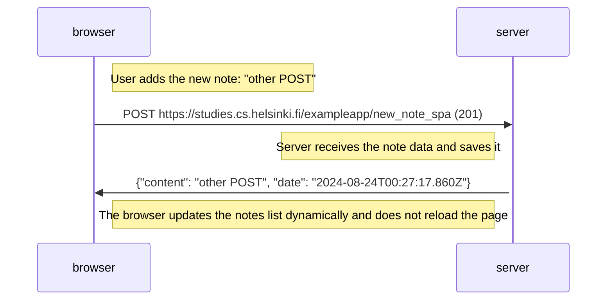

```mermaid

    sequenceDiagram
    participant browser
    participant server

    Note right of browser: User adds the new note: "other POST"
    browser->>server: POST https://studies.cs.helsinki.fi/exampleapp/new_note_spa (201)
    Note left of server: Server receives the note data and saves it
    activate server
    server->>browser: {"content": "other POST", "date": "2024-08-24T00:27:17.860Z"}
    Note right of browser: The browser updates the notes list dynamically and does not reload the page
    
```